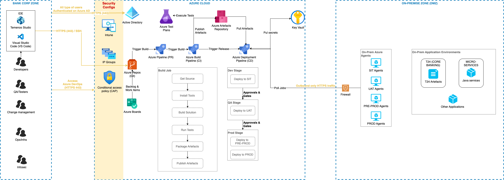

# 🎯 Target Architecture – SCM Modernization

This document outlines the **high-level target architecture** for the SCM and change management modernization initiative at BACB, transitioning from legacy SVN to Git and adopting Azure DevOps for structured, auditable, and secure delivery pipelines.

---

## 🧱 High-Level Architecture Overview

The new architecture is designed to:
- Replace SVN with Git (hosted on Azure Repos)
- Centralize change tracking and approval via Azure Boards
- Enable build and release pipelines using Azure Pipelines
- Maintain connectivity with **on-prem T24 systems** via secure agents
- Enforce auditability, traceability, and role-based access

---

## 🔧 Key Tools & Components

| Component             | Role in Architecture                                                    |
|-----------------------|-------------------------------------------------------------------------|
| **Azure Repos**       | Git-based SCM for all applications and T24 artefacts                    |
| **Azure Pipelines**   | CI/CD automation engine for build, test, and controlled deployments     |
| **Azure Boards**      | Tracks CRs, work items, and supports traceability                       |
| **Self-Hosted Agents**| Installed in on-prem DMZ to connect Azure Pipelines to internal systems |
| **Azure Key Vault**   | Centralized secrets/config management for pipelines                     |
| **Azure Wiki**        | Internal runbooks, architecture, and CR trace documentation             |
| **T24 Environment**   | Target system for deployable artefacts                                  |
| **Developer Workstations** | Local Git CLI, IDEs, secured access via SSH and VPN             |

---

## 🌐 Network Zones

The solution spans multiple **secure network zones**:

### 🔹 Cloud Zone (Azure DevOps)
- Hosted on Azure DevOps Services
- No source code or artefacts persist here beyond repository
- All communication to on-prem is via secured, whitelisted agents

### 🔹 On-Prem DMZ
- Hosts self-hosted agents (Linux/Windows)
- Enables secure pipeline execution against T24 systems
- Pull-based agent model (no inbound connectivity needed)

### 🔹 On-Prem Application Zone
- T24 core systems
- Supporting tools (e.g., COB runner, artefact directories)
- Legacy SCM systems (SVN for reference only, post-migration read-only)

---

## 🔗 Integration Touchpoints

| Integration | Description                                                                 |
|-------------|-----------------------------------------------------------------------------|
| **SVN to Git Bridge** | One-time import of history using `git svn` and `authors.txt` mapping |
| **Git Branch to CR Mapping** | Each change request (CR-xxxx) maps to a `feature/CR-xxxx` branch |
| **Pipeline to Agent** | Azure Pipelines trigger tasks on self-hosted agents via secure channels |
| **Deploy to T24** | Scripts or secure jobs move compiled artefacts (.class/.xml) to TAFJ/COB env |
| **Boards to Repo** | PRs and commits linked to CR work items in Azure Boards |
| **Audit Trails** | Logs from commits, PRs, builds, releases stored for compliance and reporting |

---

## 📊 Logical Architecture Diagram

