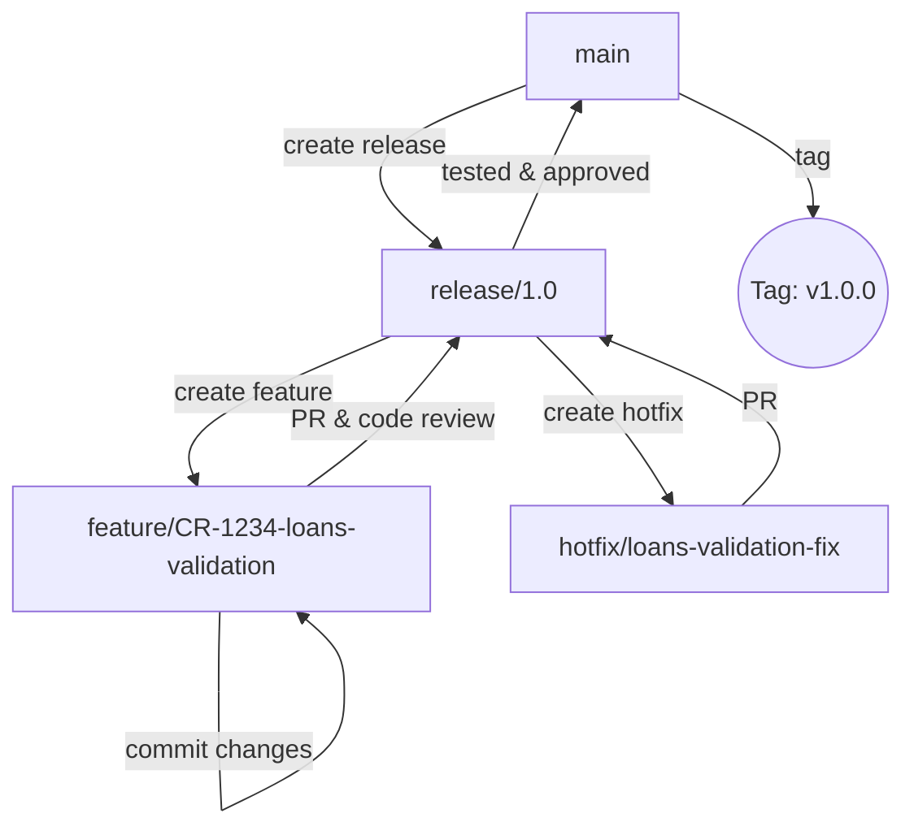
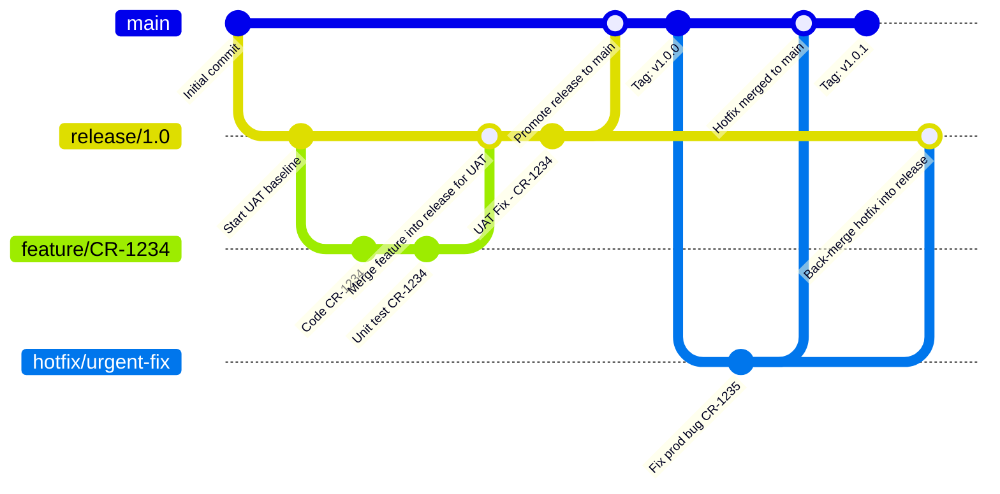

# T24 SCM & Change Management Modernization – Strategic Design Document

## 1. Introduction

### Purpose

This document outlines the strategic approach to modernize source code management (SCM) and change management processes for Temenos T24 systems. The goal is to establish traceability, auditability, and automation readiness through structured Git-based workflows and Azure DevOps integration.

### Scope

The focus is on transitioning from legacy SVN to Git, introducing structured branching, tagging, and documentation practices, and incrementally moving toward full CI/CD adoption. This strategy applies to T24 core, integrations, and supporting artefacts managed by the bank.

### Audience

This document is intended for:

* T24 developers and maintainers
* Technical leads and architects
* Change managers and release coordinators
* DevOps engineers and platform owners

### Strategic Phasing

The modernization will occur in the following phases:

1. **Phase 1:** Establish Git-based SCM and traceable change control (no CI/CD)
2. **Phase 2:** Introduce Azure DevOps for structured governance and traceability
3. **Phase 3:** Incremental rollout of CI/CD pipelines for T24 artefact automation

---

## 2. Background and Current Challenges

### Current State Overview

The current state of source code management for T24 is based on SVN with fragmented manual processes. Common characteristics include:

* No branching or versioning standards
* Change management is ad-hoc and undocumented
* Release coordination is manual and error-prone
* No formal rollback process or audit trail

### Key Pain Points

| Problem Area        | Challenge                                                            |
| ------------------- | -------------------------------------------------------------------- |
| **Traceability**    | No clear link between CR, code changes, and production deployments   |
| **Version Control** | All changes sit in trunk without branching or tagging                |
| **Collaboration**   | Difficult to manage changes across teams or domains                  |
| **Audit Readiness** | Lack of evidence for who changed what and when                       |
| **Change Risk**     | High deployment risk due to lack of rollback or test gate mechanisms |

### Need for Modernization

To align with best practices and regulatory expectations, the bank must adopt:

* Git for structured, secure, and distributed SCM
* Standardized change workflows
* Incremental CI/CD pipelines
* Integrated release visibility through Azure DevOps

---

## 🚀 Phase 1: Establish Git-Based Source Control & Change Governance

### 3. Monorepo vs Multi-Repo: Strategic Comparison

A strategic decision must be made between a monorepo (one repository for all domains) and a multi-repo (individual repositories for each domain). Based on the bank's integrated T24 platform, shared infrastructure, and cross-domain logic, a **monorepo** structure is recommended.

**Monorepo Benefits:**

* Shared governance and reusable components
* Easier cross-domain coordination and refactoring
* Central audit and release traceability

**When to consider multi-repo:**

* Teams operate in silos with no cross-dependency
* Separate vendors manage each domain with distinct infra and pipelines

### 4. Git Migration Strategy (from SVN)

#### 4.1. Preparation

* Inventory and classify SVN projects by domain (e.g., treasury, loans, payments)
* Clean up legacy commits, remove binary files
* Identify artefact types (.b, .xml, .component, etc.)

#### 4.2. Git Repository Setup

* Create `t24-core` as the root monorepo
* Organize folders under `/domains/{domain-name}`
* Migrate historical versions (optionally) using `git svn` or filtered history

#### 4.3. Commit Standards

* Ensure each commit references a CR ID
* Follow semantic commit messages

### 5. Proposed Monorepo Structure for T24

```
t24-core/
├── domains/
│   ├── treasuryloans/
│   │   ├── data-code/
│   │   ├── models/
│   │   ├── templates/
│   │   ├── versions/
│   │   ├── enquiries/
│   │   ├── routines/
│   │   ├── ofs/
│   │   ├── cob/
│   │   └── package/
│   └── payments/...
├── shared-libs/
├── .pipeline/
└── README.md
```

### 6. Branching, Tagging & Commit Conventions

A well-defined Git branching and tagging strategy ensures parallel development, controlled releases, traceability, and simplified rollbacks. The following branching model is tailored for a monorepo managing T24 artefacts across domains.

#### 6.1. Branch Types

| Branch Type    | Naming Convention        | Purpose                                       |
| -------------- | ------------------------ | --------------------------------------------- |
| `main`         | `main`                   | Stable, production-ready codebase             |
| Release Branch | `release/{version}`      | For UAT and controlled rollout                |
| Feature Branch | `feature/CR-{id}-{desc}` | Isolated development per CR or change request |
| Hotfix Branch  | `hotfix/{domain}-{desc}` | For urgent production fixes                   |

#### 6.2. Workflow

1. Start from `main` or latest `release/{version}`
2. Create `feature/CR-xxxx-scope` branch
3. Perform development, commit using CR ID
4. Raise PR to `release/x.y` (UAT/testing branch)
5. Once tested and approved, merge to `main` and tag

#### 6.3. Tagging Convention

* Semantic versioning: `v{major}.{minor}.{patch}`
* Scoped tag example: `treasuryloans-data-code-v1.2.0`
* Tags applied only on `main` after successful merge

#### 6.4. Visual Flow Diagram



#### 6.1. Branching Strategy

* `main`: stable production-ready code
* `release/x.y`: release branch for UAT and production approval
* `feature/CR-xxxx-shortdesc`: one per change request

#### 6.2. Tagging

* Semantic and scoped per domain/module
* Example: `treasuryloans-data-code-v1.2.0`

#### 6.3. Commit Format

```
feat(treasuryloans-data-code): add override routine [CR-1123]
```

### 7. BAU Change Process with Git (Without CI/CD)

A structured Git process enables disciplined change management and traceability even without CI/CD. Below is a visual representation of the Business-As-Usual (BAU) change workflow:

#### 7.1. Visual Workflow Diagram



#### 7.2. Change Lifecycle

1. Developer creates `feature/CR-xxxx` branch
2. Commits made with CR ID and appropriate type
3. Pull request raised to `release/x.y`, code reviewed and tested
4. Once approved, merged to `main` and tagged
5. Manual deployment instructions executed from tagged version
6. CR board and deployment registry updated accordingly

#### 7.1. Change Lifecycle

1. Developer creates `feature/CR-xxxx` branch
2. Commits made with CR ID and type
3. PR created and reviewed
4. Approved PR merged to `release/x.y`
5. Tagged release prepared for manual deployment

#### 7.2. Deployment

* Scripts or manual instructions used to move `.class`, `.xml` artefacts to TAFJ
* Release notes stored in Wiki or Markdown in repo

#### 7.3. Rollback

* Previous tags used to identify known-good state
* Manual re-deployment of prior artefacts possible

---

## 🧱 Phase 2: Setup of Azure DevOps Platform for Governance & Traceability

### 8. Azure DevOps Project Structure

Azure DevOps will be structured to reflect logical application groupings, simplify access control, and improve traceability.

#### 8.1. Project Hierarchy

| Project Name        | Description                                    |
| ------------------- | ---------------------------------------------- |
| `T24-Core`          | T24 routines, versions, templates, COB jobs    |
| `T24-Integrations`  | MQ, OFS handlers, APIs, message mappings       |
| `Channel-Apps`      | Internet/mobile banking, onboarding UI         |
| `Enterprise-Shared` | Common utilities, libraries, templates         |
| `DevOps-Automation` | CI/CD templates, pipeline logic, infra as code |

#### 8.2. Repository Design (Within Projects)

* Single monorepo per project (recommended for shared deployment cycles)
* Logical folder layout under `/domains/` as defined in Phase 1
* Shared modules placed in `/shared-libs/`

#### 8.3. Access & Permissions

* Azure DevOps groups mapped to teams/domains
* Folder-level protections and PR enforcement rules enabled

### 9. Azure DevOps Wiki, Boards & Release Tracking

#### 9.1. Wiki Documentation Structure

| Section                 | Purpose                                        |
| ----------------------- | ---------------------------------------------- |
| `Release Notes`         | Tag-wise deployment summaries                  |
| `CR Traceability Logs`  | Links between CR → Commit → Tag                |
| `Technical Design Docs` | Domain-specific architecture or change details |
| `Deployment Guides`     | Step-by-step instructions for manual release   |

#### 9.2. Boards & Change Request Integration

* Work items represent CRs or stories (e.g., `CR-1123`)
* PRs are linked directly to Boards
* Dashboards provide visibility into ongoing and completed changes

#### 9.3. Manual Release Registry

* Use Boards or Wiki to log manual deployments
* Include artefact versions, tag, timestamp, and approvers

---

## ⚙️ Phase 3: CI/CD Pipeline Strategy (Optional for Future Adoption)

### 10. CI/CD Design Overview

The CI/CD pipeline strategy for T24 aims to automate compilation, testing, and deployment of T24 artefacts in a secure and traceable manner. Adoption of CI/CD is optional in the initial phase but recommended for long-term DevOps maturity.

#### 10.1. Pipeline Stages

* **CI Stage**: Checkout → Compile `.b` files with `jbc` → Package into JARs or `.class`
* **Validation**: Lint checks, static analysis, structure validation
* **CD Stage**: Deploy `.class` or packaged files to DEV/UAT/PROD environments
* **Post-Deploy**: Run validations, generate deployment logs, notify stakeholders

### 11. Artefact Management & Release Automation

#### 11.1. Artefact Types

* `.class` files compiled from `.b` routines
* XML configurations for templates, versions, enquiries
* Optional JARs containing compiled logic and dependencies

#### 11.2. Versioning

* Artefacts tagged per domain/module (e.g., `payments-data-code-v2.1.0`)
* Git tags used for rollback and audit

#### 11.3. Release Automation

* Azure Pipelines or Jenkins used to automate deployments
* Artefact registry or build storage for rollback
* Approvals and gates configured before PROD deployment

### 12. Audit, Logs & Compliance

#### 12.1. Traceability Chain

```
CR → Branch → Commit → PR → Tag → Artefact → Deployment Log
```

#### 12.2. Evidence Generation

* PR comments and merge approvals
* Pipeline logs and deployment results
* Tag history and artefact hash

---

## 🧰 13. Tools, Templates & Standards

### 13.1. Git Standards

* `.gitignore` to exclude binaries, build artefacts
* Commit message format enforcing CR references
* Branching templates with PR checklists

### 13.2. CI/CD Templates

* Reusable YAML templates for:

  * Compile `.b` routines
  * Package JARs or `.class` artefacts
  * Deploy to DEV/UAT/PROD via SSH/SCP or agents

### 13.3. Documentation Templates

* Wiki templates for CR documentation
* Release summary format
* Deployment guide checklists

### 13.4. Tooling Stack

| Function         | Tool            |
| ---------------- | --------------- |
| Git hosting      | Azure Repos     |
| CI/CD            | Azure Pipelines |
| Documentation    | Azure Wiki      |
| Work tracking    | Azure Boards    |
| Artefact storage | Azure Artifacts |

---

## 🗺️ 14. Migration Roadmap & Adoption Plan

| Timeline     | Activity                                                              |
| ------------ | --------------------------------------------------------------------- |
| Week 1–2     | Audit existing SVN structure, identify domains and artefact types     |
| Week 3–4     | Setup Git monorepo with defined folder structure                      |
| Week 5–6     | Migrate active codebase and train developers on Git process           |
| Week 7–8     | Implement branching, commit policy, and manual release process in Git |
| Week 9–10    | Introduce Azure DevOps projects, Boards, and Wikis                    |
| Future Phase | CI/CD implementation per domain as readiness increases                |

---

## 📈 15. Expected Benefits

| Area               | Benefit                                                            |
| ------------------ | ------------------------------------------------------------------ |
| Traceability       | Clear CR-to-code-to-deploy tracking via Git, Boards, and tags      |
| Audit & Compliance | Full audit trail for each deployment, commit, and release decision |
| Developer Velocity | Reduced friction, better collaboration, faster debugging           |
| Risk Mitigation    | Safer deployments with rollback support and staging validations    |
| DevOps Maturity    | Foundation for full CI/CD, infra-as-code, and automated governance |

---

## 📎 16. Appendices

### A. Git Commit Format Examples

| Type       | Description                              |
| ---------- | ---------------------------------------- |
| `feat`     | A new feature or functionality           |
| `fix`      | A bug fix or correction                  |
| `chore`    | Routine tasks like build config, cleanup |
| `refactor` | Code change that neither fixes nor adds  |
| `docs`     | Changes to documentation only            |
| `test`     | Adding or updating test cases            |
| `style`    | Formatting, missing semi colons, etc.    |
| `perf`     | Performance improvement                  |
| `ci`       | Changes to CI configuration or scripts   |

```
feat(treasuryloans-data-code): implement new loan logic [CR-1123]
fix(payments): handle edge case in FX validation [CR-1189]
```

### B. GitOps Flow Visual

```
CR → Git Branch → Commits → PR → Tag → Deploy → Audit
```

### C. Sample Monorepo Directory Template

```
t24-core/
├── domains/
│   ├── treasuryloans/
│   │   ├── versions/
│   │   ├── routines/
│   │   ├── enquiries/
│   │   ├── cob/
│   │   └── ofs/
├── shared-libs/
├── .pipeline/
└── README.md
```

---

End of Document
